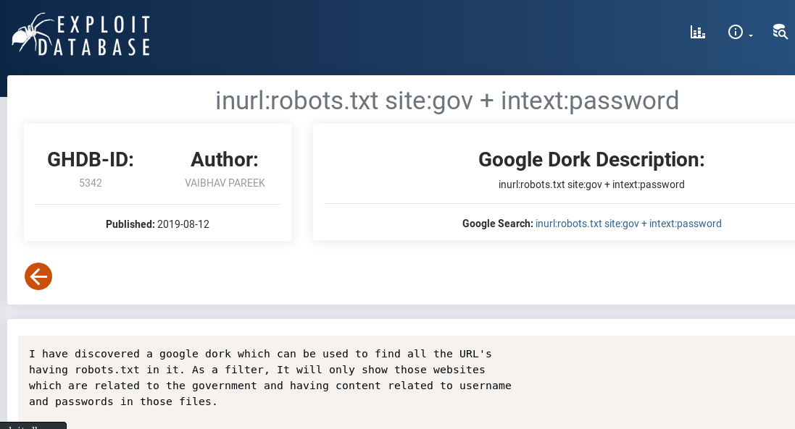
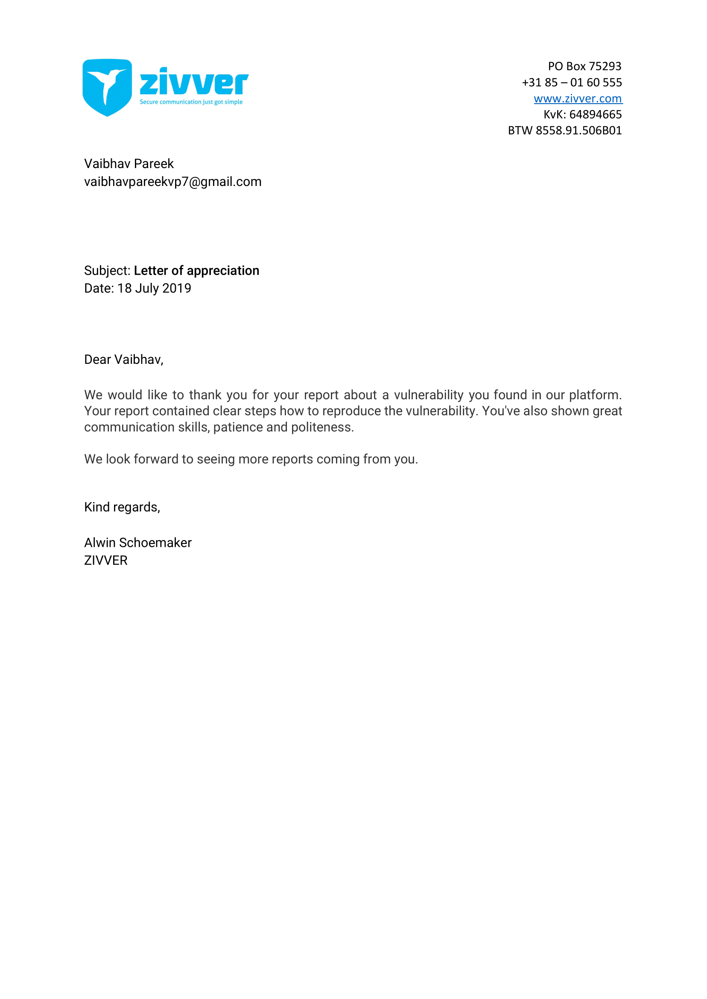

## Welcome to Vaibhav Binary : chmod +x ./vaibhavpareek -> Task Completed..
[](https://vaibhavpareek.github.io)
[](https://www.linkedin.com/in/vaibhavvp/)

 

<link rel="stylesheet" type="text/css" href="css/main.css">
<h3 style="color:#6a9fb5;">
<strong>👀Vaibhav</strong> is a team player who likes to play with technology. He is trying to fulfill his wish of becoming the best Technocrat in the world. He loves automation in his works, playing with the codes, resolving errors, and contributing to other's work. A strong believer in <strong>"Let's Stop Believing, Start Exploring "🔓.</strong></h3>

### cat >> vaibhav_ideology.vp

💯Vaibhav believes the best way to learn anything is by implementing that in real-life scenarios through a 🔃PROJECT. So, he always learn anything by implementing technologies mentioned below in projects. 


### Installing Libraries......

```markdown
# Collecting.......
✅Machine Learning ✅Computer Vision          ✅Feature Selection Automation 
✅IBM Cloud        ✅Linux Server Management  🆕Node-Red Automation 
✅DevOps           ✅Cyber Security           ✅ACL Management
✅IBM Watson       ✅Web Development
```

### cat >> recent_projects.vp
- [FeatSel - A Feature Selection Tool](https://github.com/vaibhavpareek/Featsel)
- [DocSec - Docker Vault for Encrypting Secrets](https://github.com/vaibhavpareek/DocSec)
- [Vulnorator - Footprinting Tool](https://github.com/vaibhavpareek/vulnorator)


### cat >> certifications.vp
- [Information Security Certified Professional - Krademy under TCOE India](https://www.linkedin.com/in/vaibhavvp/detail/treasury/position:1476477697/?entityUrn=urn%3Ali%3Afsd_profileTreasuryMedia%3A(ACoAACO628kBsGtn5bvzo4nf9ZFH9uQQwAVKymw%2C1565839138630)&section=position%3A1476477697&treasuryCount=4)
- [AMCAT Examination Report](https://www.linkedin.com/in/vaibhavvp/detail/treasury/education:441762257/?entityUrn=urn%3Ali%3Afsd_profileTreasuryMedia%3A(ACoAACO628kBsGtn5bvzo4nf9ZFH9uQQwAVKymw%2C1589516882718)&section=education%3A441762257&treasuryCount=1)
- [Expertise in Docker(Training + Project) - IIEC Community under Mr. Vimal Daga](https://drive.google.com/file/d/1QrjaVPLpuEhh1xoZv6KmK2W4tvCOhgsb/view)
- MLOPS(Applying Machine Learning in DevOps) (Training + Project) - Pursuing..


### cat >> blogs.vp
- [Medium - Technical Blog](https://medium.com/@vaibhavpareekvp7)
- [GeeksForGeeks - Technical Articles](https://auth.geeksforgeeks.org/user/eternity_vaibhav/articles)
- [Speakifyoucan - Non-Technical(Philosophical)](https://speakifyoucan.blogspot.com)


### cat >> vulnerability_reported.vp
- [SpringerNature](https://www.springernature.com/in/info/disclosure)
- [Orged](https://orged.de/bug-bountry/hall-of-fame)
- [DutchDare](https://www.dutchdare.nl/index.php/hall-of-fame/)
- [LumasLabs](https://www.linkedin.com/in/vaibhavvp/)
- [Zivver](https://www.linkedin.com/in/vaibhavvp/)

### cat >> web_experience.vp
- [www.buzzintely.com](http://buzzintely.com/)
- [www.vanisco.in](https://vanisco.in)
- [www.apartmentsinbarbados.eu](https://www.apartmentsinbarbados.eu/)
- [www.sleenaindia.com](https://sleenaindia.com/)
- [www.c4you.in](https://c4you.in)

### cat >> organizations.vp
- [CompTIA (Campus Ambassador)](https://www.comptia.org/contact-us/regional-sites/comptia-india)
- [CyberHack (Technical Head)](https://www.cyberhack.co.in/)

```markdown
# Installing Languages......

# Downloading.......
💢Python 💢CPP 💢 Java 💢 PHP
```
<div class="slideshow-container">

<div class="mySlides fade">
  <div class="numbertext">1 / 10</div>
  
  <div class="text" style="color:black;">CyberHack-LoopHole Event</div>
</div>

<div class="mySlides fade">
  <div class="numbertext">2 / 10</div>
  
  <div class="text" style="color:black;">Amcat Certificate</div>
</div>
<div class="mySlides fade">
  <div class="numbertext">3 / 10</div>
  
  <div class="text" style="color:black;">Docker Training Certificate</div>
</div>
<div class="mySlides fade">
  <div class="numbertext">4 / 10</div>
  
  <div class="text" style="color:black;">CompTIA Memories</div>
</div>
<div class="mySlides fade">
  <div class="numbertext">5 / 10</div>
  
  <div class="text" style="color:black;">ISCP Certificate</div>
</div>
<div class="mySlides fade">
  <div class="numbertext">6 / 10</div>
  
  <div class="text" style="color:black;">CompTIA</div>
</div>
<div class="mySlides fade">
  <div class="numbertext">7 / 10</div>
  
  <div class="text" style="color:black;">LumusLabs RVDP</div>
</div>
<div class="mySlides fade">
  <div class="numbertext">8 / 10</div>
  
  <div class="text" style="color:black;">Vulnorator Appreciation Letter</div>
</div>
<div class="mySlides fade">
  <div class="numbertext">9 / 10</div>
  
  <div class="text" style="color:black;">Google Dork Published</div>
</div>
<div class="mySlides fade">
  <div class="numbertext">10/ 10</div>
  
  <div class="text" style="color:black;">Zivver Letter</div>
</div>


</div>
<br>

<div style="text-align:center">
  <span class="dot" ></span> 
  <span class="dot" ></span> 
  <span class="dot" ></span>
  <span class="dot" ></span>
  <span class="dot" ></span>
  <span class="dot" ></span>
  <span class="dot" ></span>
  <span class="dot" ></span>
  <span class="dot" ></span>
  <span class="dot" ></span>
</div>
<script>
var slideIndex = 0;
showSlides();

function showSlides() {
  var i;
  var slides = document.getElementsByClassName("mySlides");
  for (i = 0; i < slides.length; i++) {
    slides[i].style.display = "none";
  }
  slideIndex++;
  if (slideIndex > slides.length) {slideIndex = 1}
  slides[slideIndex-1].style.display = "block";
  setTimeout(showSlides, 2000); // Change image every 2 seconds
} 
</script>

### Contact @vaibhavpareekvp7@gmail.com
