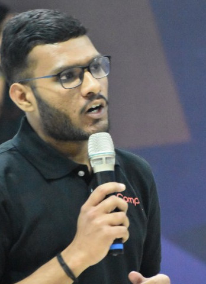
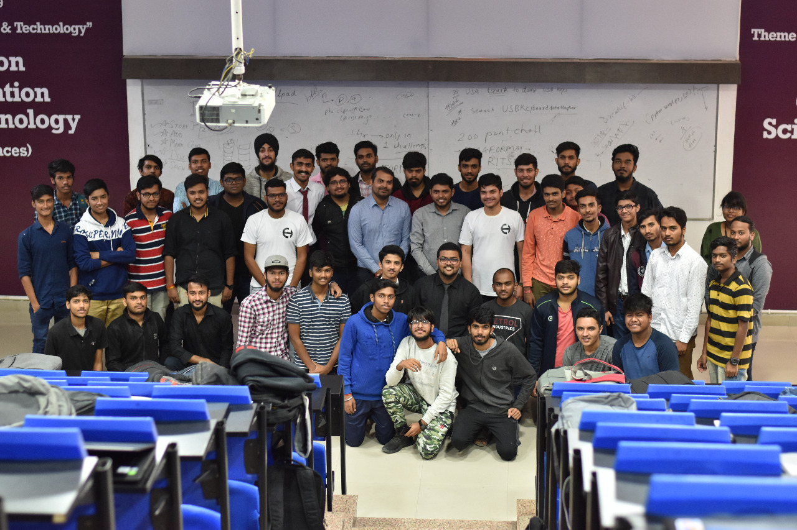
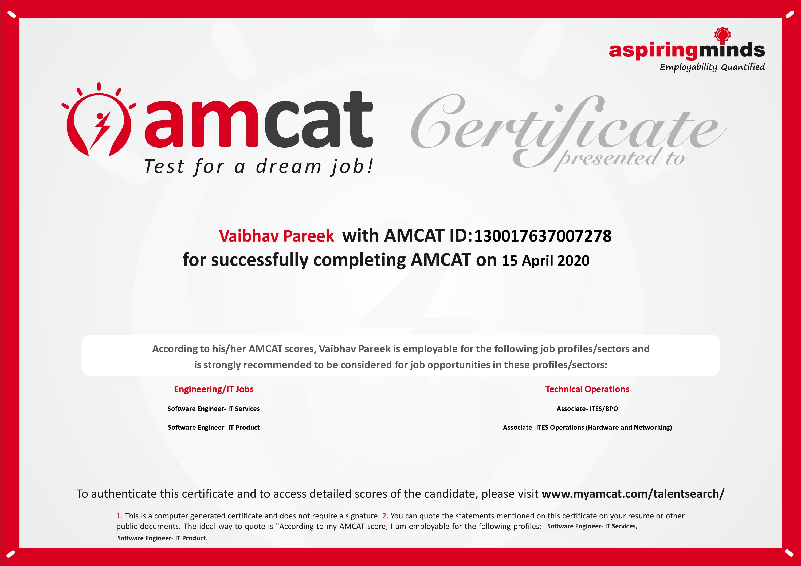
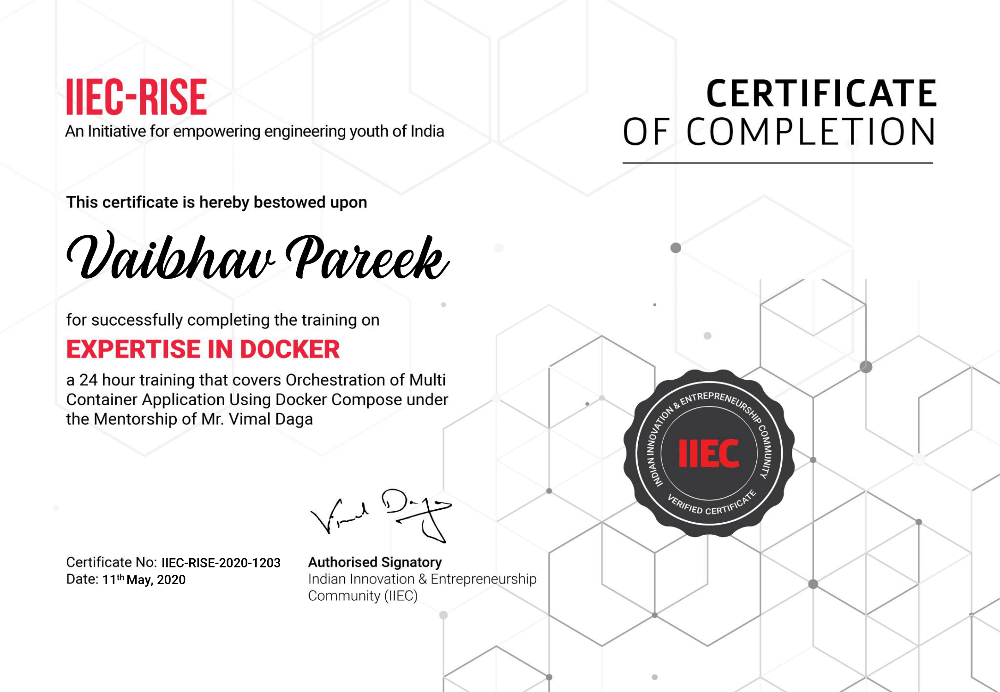
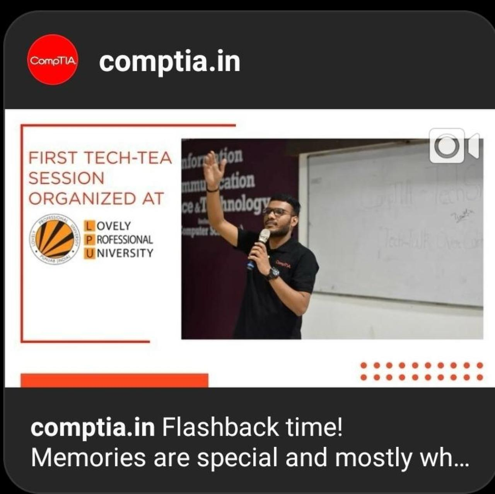
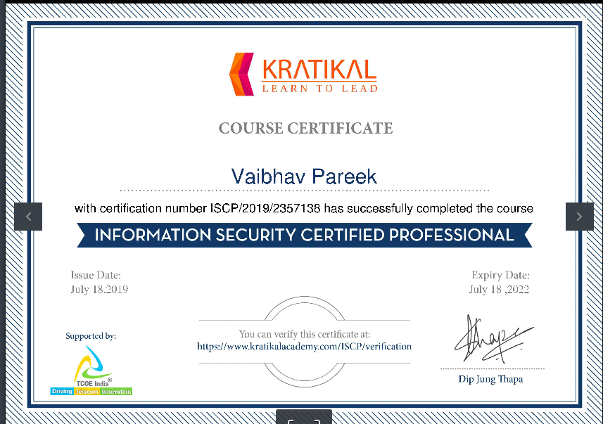
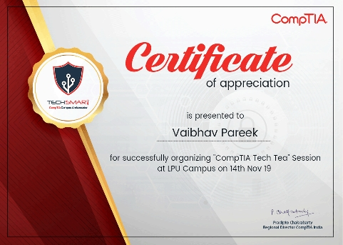
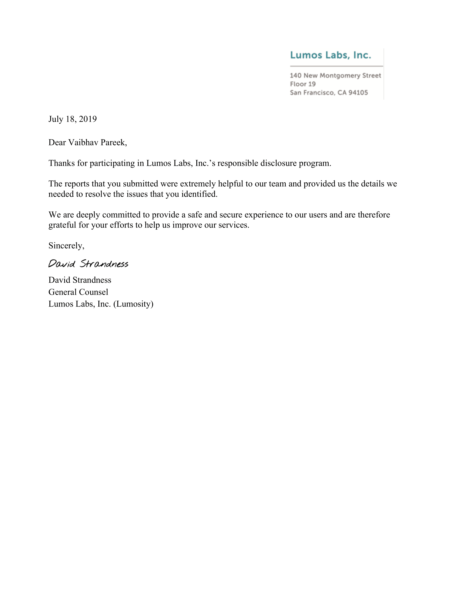

## Welcome to Vaibhav Binary : chmod +x ./vaibhavpareek -> Task Completed..
 

<link rel="stylesheet" type="text/css" href="css/main.css">
<script src="js/main.js"></script>
<h3>
<strong>👀Vaibhav</strong> is a team player and developer who has experience of about 3 years of working in multiple technologies, programming languages and building projects. </h3>

### cat >> vaibhav_ideology.vp

💯Vaibhav believes the best way to learn anything is by implementing that in real-life scenarios through a 🔃PROJECT. So, he always learn anything by implementing technologies mentioned above in projects. 


### Installing Libraries......

```markdown
# Collecting.......
✅Machine Learning ✅Computer Vision          ✅Feature Selection Automation 
✅IBM Cloud        ✅Linux Server Management  🆕Node-Red Automation 
✅DevOps           ✅Cyber Security           ✅ACL Management
✅IBM Watson       ✅Web Development
```

### cat >> recent_projects.vp
- [FeatSel - A Feature Selection Tool](https://github.com/vaibhavpareek/Featsel)
- [DocSec - Docker Vault for Encrypting Secrets](https://github.com/vaibhavpareek/DocSec)
- [Vulnorator - Footprinting Tool](https://github.com/vaibhavpareek/vulnorator)

### cat >> certifications.vp
- [Information Security Certified Professional - Krademy under TCOE India](https://www.linkedin.com/in/vaibhavvp/detail/treasury/position:1476477697/?entityUrn=urn%3Ali%3Afsd_profileTreasuryMedia%3A(ACoAACO628kBsGtn5bvzo4nf9ZFH9uQQwAVKymw%2C1565839138630)&section=position%3A1476477697&treasuryCount=4)
- [AMCAT Examination Report](https://www.linkedin.com/in/vaibhavvp/detail/treasury/education:441762257/?entityUrn=urn%3Ali%3Afsd_profileTreasuryMedia%3A(ACoAACO628kBsGtn5bvzo4nf9ZFH9uQQwAVKymw%2C1589516882718)&section=education%3A441762257&treasuryCount=1)
- [Expertise in Docker(Training + Project) - IIEC Community under Mr. Vimal Daga](https://drive.google.com/file/d/1QrjaVPLpuEhh1xoZv6KmK2W4tvCOhgsb/view)
- MLOPS(Applying Machine Learning in DevOps) (Training + Project) - Pursuing..


### cat >> vulnerability_reported.vp
- [SpringerNature](https://www.springernature.com/in/info/disclosure)
- [Orged](https://orged.de/bug-bountry/hall-of-fame)
- [DutchDare](https://www.dutchdare.nl/index.php/hall-of-fame/)
- [LumasLabs](https://www.linkedin.com/in/vaibhavvp/)
- [Zivver](https://www.linkedin.com/in/vaibhavvp/)

### cat >> web_experience.vp
- [www.buzzintely.com](http://buzzintely.com/)
- [www.vanisco.in](https://vanisco.in)
- [www.apartmentsinbarbados.eu](https://www.apartmentsinbarbados.eu/)
- [www.sleenaindia.com](https://sleenaindia.com/)

### cat >> organizations.vp
- [CompTIA (Campus Ambassador)](https://www.comptia.org/contact-us/regional-sites/comptia-india)
- [CyberHack (Technical Head)](https://www.cyberhack.co.in/)

```markdown
# Installing Languages......

# Downloading.......
💢Python 💢CPP 💢 Java 💢 PHP
```

<div class="slideshow-container">

<div class="mySlides fade">
  <div class="numbertext">1 / 7</div>
  
  <div class="text" style="color:black;">CyberHack-LoopHole Event</div>
</div>

<div class="mySlides fade">
  <div class="numbertext">2 / 7</div>
  
  <div class="text" style="color:black;">Amcat Certificate</div>
</div>
<div class="mySlides fade">
  <div class="numbertext">3 / 7</div>
  
  <div class="text" style="color:black;">Docker Training Certificate</div>
</div>
<div class="mySlides fade">
  <div class="numbertext">4 / 7</div>
  
  <div class="text" style="color:black;">CompTIA Memories</div>
</div>
<div class="mySlides fade">
  <div class="numbertext">5 / 7</div>
  
  <div class="text" style="color:black;">ISCP Certificate</div>
</div>
<div class="mySlides fade">
  <div class="numbertext">6 / 7</div>
  
  <div class="text" style="color:black;">CompTIA</div>
</div>
<div class="mySlides fade">
  <div class="numbertext">7 / 7</div>
  
  <div class="text" style="color:black;">LumusLabs RVDP</div>
</div>


<a class="prev" onclick="plusSlides(-1)">&#10094;</a>
<a class="next" onclick="plusSlides(1)">&#10095;</a>

</div>
<br>

<div style="text-align:center">
  <span class="dot" onclick="currentSlide(1)"></span> 
  <span class="dot" onclick="currentSlide(2)"></span> 
  <span class="dot" onclick="currentSlide(3)"></span>
  <span class="dot" onclick="currentSlide(4)"></span>
  <span class="dot" onclick="currentSlide(5)"></span>
  <span class="dot" onclick="currentSlide(6)"></span>
  <span class="dot" onclick="currentSlide(7)"></span>
</div>


### Contact @vaibhavpareekvp7@gmail.com
